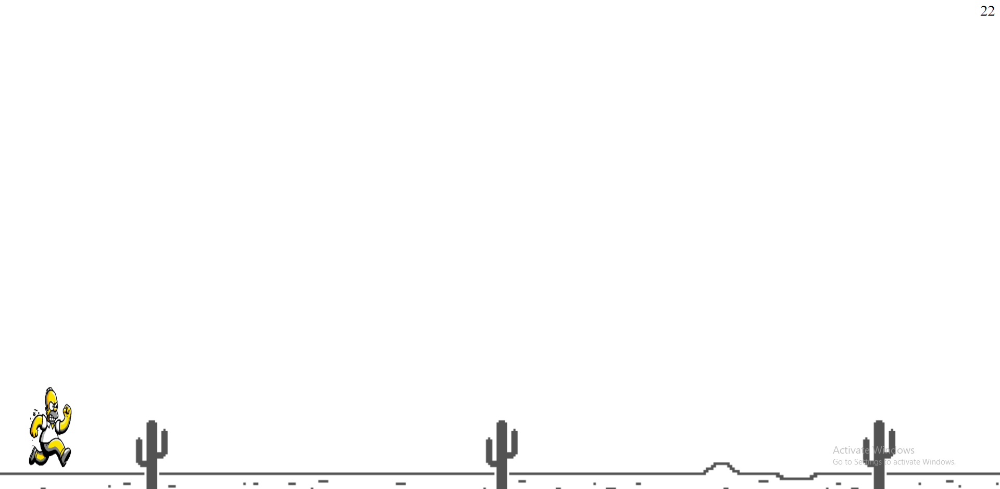

# simpsons-game
Welcome to the Simpsons Run Game! This game is a mock-up dinosaur Chrome game based on The Simpsons universe. The game is built using HTML, JavaScript, and CSS.

## Description

In this game, players control simpsons characters as they run through the streets of Springfield. The objective is to navigate Homer through obstacles and collect as many points as possible.

## Features

- **Simpson Character**: Play as any of the fictional Simpson Family characters.
- **Simpsons-Themed Obstacles**: Dodge obstacles inspired by The Simpsons universe, such as donuts, flaming Moes, Duff beer barrels, and more.
- **Scoring System**: Collect points by successfully navigating through obstacles and reaching milestones.
- **Simple Controls**: Use the spacebar or up arrow key to make Homer jump over obstacles.

## Screenshots

*Screenshot of Homer Simpson running through Springfield.*

## Getting Started

To run the game locally, follow these steps:

1. Clone this repository to your local machine.
2. Open the `index.html` file in your preferred web browser.
3. Enjoy playing the Simpsons Run Game!

## Credits

- Game developed by Darius Guillaume
- Images generated using Copilot by Microsoft

## License

This project is licensed under the MIT License - see the [LICENSE](LICENSE) file for details.
